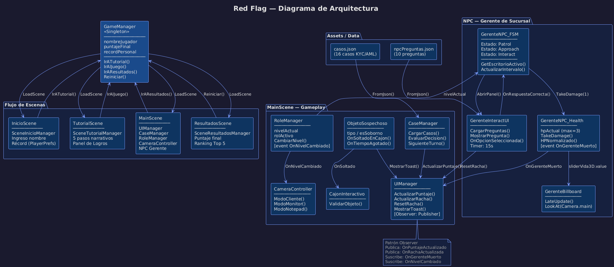

# Red Flag 🚩
### Simulador de Gestión de Riesgo y Cumplimiento Bancario (Serious Game)

**Universidad de Santiago de Chile — Departamento de Ingeniería Informática**  
**Asignatura:** Ingeniería de Videojuegos: Fundamentos y Aplicaciones Interactivas  
**Entrega Final (Lab 6):** Producto Integrado  
**Desarrolladores:** Diego Altamirano • Felipe Cifuentes • Byron Obregón

---

## 📖 Descripción del Proyecto

**Red Flag** es un *serious game* 3D desarrollado en Unity que gamifica la capacitación en compliance y prevención de delitos financieros bajo la regulación bancaria chilena. El jugador asume el papel de un Analista de Cumplimiento del *Banco Central del Sur* que debe auditar expedientes de clientes en tiempo real y tomar decisiones de aprobación, rechazo o escalamiento basándose en leyes reales (Ley N°19.913, Ley N°20.393, Circular UAF N°62).

---

## 🏗️ Diagrama de Arquitectura del Proyecto



---

## 🎮 Flujo de Escenas

El flujo narrativo y de control del juego está dividido en cuatro escenas principales:

| Escena | Propósito |
| --- | --- |
| `InicioScene` | Ingreso del nombre del jugador y visualización del récord personal guardado localmente |
| `TutorialScene` | Introducción narrativa (5 pasos) con contexto del banco, controles y panel de logros |
| `MainScene` | Gameplay principal — análisis de 5 casos bajo presión de tiempo y agentes distractores |
| `ResultadosScene` | Puntaje final, detección de nuevo récord y ranking histórico (Top 5 local) |

> **Nota sobre la Pantalla de Inicio:** La escena `TutorialScene` funciona como la "Pantalla de Introducción Narrativa" del juego. Cumple el rol de onboarding contextual e instruccional para el jugador, resolviendo la inducción normativa antes de comenzar la jornada.

---

## 📑 Manual de Uso del Analista (Guía Técnico-Narrativa)

### ⌨️ Controles Básicos

El juego simula la perspectiva de trabajo de un analista mediante un sistema de **3 cámaras o vistas** sobre el escritorio:

| Comando | Acción | Vista en el Juego |
| :---: | --- | --- |
| **`E`** | **Zoom a Monitor** | Accede al panel de documentos digitales del cliente (pestañas KYC y AML) |
| **`Q`** | **Zoom a Notepad** | Revisa el expediente interno del caso y las discrepancias registradas |
| **`ESC`** | **Vista Cliente** | Vuelve a mirar de frente al cliente 3D para interrogarlo o tomar la decisión final |
| **`W`** | **Alternar Escritorio** | *(Nivel 2+)* Alterna entre tu escritorio y el del Analista 2 para coordinar información |
| **Click en Cliente** | **Interrogación** | Lanza diálogos directos con el cliente sobre origen de fondos, actividad o documentos |
| **Click en campo del Notepad** | **Cotejo de datos** | Contrasta el dato seleccionado con la respuesta del cliente para detectar discrepancias |

---

### 🔍 Flujo de Análisis de Compliance (Paso a Paso)

Para tomar la decisión correcta en cada caso debes seguir estos pasos de auditoría:

1. **Revisar el Monitor (`E`):** Audita si los documentos están vigentes (cédula, foto, RUT, domicilio verificado, actividad económica consistente).
2. **Revisar el Notepad (`Q`):** Abre la carpeta del caso. Verifica si hay discrepancias listadas, transacciones inusuales o si el cliente está marcado como **PEP** (Persona Expuesta Políticamente).
3. **Interrogar al Cliente (`ESC` + Click):** Formula preguntas sobre actividad económica, origen de fondos o declaraciones de PEP directamente al personaje 3D.
4. **Tomar la Decisión:** Con la información completa, usa uno de los 3 botones:

| Botón | Cuándo usarlo |
| --- | --- |
| ✅ **APROBAR** | El expediente es consistente, documentos vigentes, sin discrepancias normativas |
| ⚠️ **ESCALAR** | Discrepancias moderadas o transacciones atípicas que requieren revisión de Supervisor |
| ❌ **RECHAZAR** | Suplantación de identidad, documentación vencida, origen de fondos ilícito o flagrante |

---

### ⚖️ Guía de Normativa Bancaria Chilena Integrada

Para evaluar cada caso correctamente debes contrastar los datos contra las tres leyes incorporadas al simulador:

**Circular UAF N°62 — Conocimiento del Cliente (KYC)**  
Regula la debida diligencia. Si el cliente no presenta domicilio acreditable, su firma no coincide o se niega a declarar su actividad comercial → **Rechazar** por infracción a las normativas de identificación del cliente.

**Ley N°19.913 — Prevención del Lavado de Activos (AML)**  
Si detectas transferencias fraccionadas provenientes de paraísos fiscales o inconsistencias en los ingresos declarados en la pestaña AML → el caso debe ser **Escalado** o **Rechazado** de inmediato para evitar complicidad del banco en lavado de dinero.

**Ley N°20.393 — Responsabilidad Penal y Prevención del Cohecho**  
Regula a las Personas Expuestas Políticamente (PEPs) y el soborno a funcionarios. Si un cliente es familiar de un alto cargo público y no lo declaró en su formulario → **Rechazar**. Si aparecen sobornos físicos en la escena (sobres, cajas de regalo) → **ignorarlos** completamente.

---

## 🛠️ Mecánicas de Presión Implementadas

### 1. Sistema de Puntuación con Multiplicador de Racha
- Cada decisión correcta suma puntos base según el tipo de caso.
- Las decisiones correctas consecutivas incrementan el multiplicador (×1 → ×2 → ×3...).
- El HUD muestra el multiplicador activo con animación de brillo y escala.
- Los errores resetean el multiplicador a ×1.0.

### 2. Objetos Sospechosos y Sobornos en el Escritorio

Durante la jornada aparecerán objetos en 3D sobre el escritorio de forma aleatoria:

| Tipo de objeto | Acción correcta | Consecuencia de ignorarlo |
| --- | --- | --- |
| 🔐 Seguridad (Pendrive, Post-it, Credencial) | Arrastrarlo al cajón abierto | -200 puntos al expirar el tiempo |
| 💰 Sobornos (Sobre de efectivo, Caja de regalo) | No tocarlo. Esperar que desaparezca | +100 puntos por integridad profesional |

> **¡Atención!** Guardar un soborno en el cajón es una infracción directa a la Ley N°20.393 y reseteará tu racha de multiplicador.

### 3. NPC: Gerente de Sucursal (FSM Autónoma)

El Gerente es un agente autónomo con inteligencia artificial basada en una **Máquina de Estados Finitos (FSM)** de 3 estados:

| Estado FSM | Comportamiento |
| --- | --- |
| **Patrol** | Camina entre los waypoints de la oficina (WP_1 → WP_4) con sistema de *fallback* aleatorio anti-atascos |
| **Approach** | Al cumplirse el intervalo de visita, navega al escritorio activo del jugador según el nivel (KYC, AML o Supervisor) |
| **Interact** | Se detiene frente al escritorio y despliega una UI de pregunta de normativa real con timer de 15 segundos |

**Barra de Vida Flotante 3D:** El Gerente tiene un Slider en World Space sobre su cabeza (verde lleno → rojo vacío) con comportamiento *Billboard* que lo mantiene siempre de frente al jugador.

**Mecánica de interacción:**
- ✅ **Respuesta correcta:** le aplicas 1 HP de daño. Tras 3 aciertos, el Gerente es retirado definitivamente (Toast en HUD + contador).
- ❌ **Error o timeout:** pierdes 100 puntos, el multiplicador vuelve a ×1.0 y el Gerente "espía" tus expedientes antes de retirarse.

---

## 📦 Estructura de Directorios

```
Assets/
├── Data/
│   ├── casos.json              # Base de datos de 16 casos KYC/AML/Compliance
│   └── npcPreguntas.json       # Banco de 10 preguntas regulatorias del Gerente
├── Scenes/
│   ├── InicioScene             # Pantalla de inicio y registro del nombre
│   ├── TutorialScene           # Introducción narrativa y panel de logros
│   ├── MainScene               # Gameplay principal
│   └── ResultadosScene         # Pantalla de resultados y ranking
├── UI/
│   ├── RedFlagUI.uxml          # Diseño HUD, Modales y panel Gerente (UI Toolkit)
│   └── RedFlagUI.uss           # Hojas de estilo CSS del juego
└── Scripts/
    ├── GameManager.cs          # Singleton: flujo de escenas, nombre, récord y ranking
    ├── UIManager.cs            # HUD, toasts, Observer de eventos del juego
    ├── CaseManager.cs          # Carga, validación y puntaje de decisiones desde JSON
    ├── RoleManager.cs          # Control de nivel activo y roles (KYC/AML/Supervisor)
    ├── CameraController.cs     # Transición suavizada entre las 3 vistas
    ├── ObjetoSospechoso.cs     # Lógica de objetos interactivos y sobornos
    ├── GerenteNPC_FSM.cs       # FSM del Gerente (Patrol / Approach / Interact)
    ├── GerenteNPC_Health.cs    # HP del Gerente y control de la barra 3D
    ├── GerenteBillboard.cs     # Rotación Billboard del Canvas de vida flotante
    ├── GerenteInteractUI.cs    # Carga de JSON y lógica del panel de preguntas
    ├── SceneInicioManager.cs   # Controlador de pantalla de inicio
    ├── SceneTutorialManager.cs # Controlador de inducción narrativa y logros
    └── SceneResultados.cs      # Controlador de ranking e historial local
```

---

## 🗃️ Agregar Nuevos Casos al Banco de Datos

Edita `Assets/Data/casos.json` y añade entradas con esta estructura:

```json
{
  "id": "#00147",
  "tipo": "KYC",
  "prioridad": "ALTA",
  "cliente": {
    "nombre": "Nombre Apellido",
    "rut": "12.345.678-9",
    "nacionalidad": "Chilena",
    "actividad": "Actividad económica",
    "esPEP": false
  },
  "documentos": {
    "cedulaVigente": true,
    "fotoCoincide": true,
    "rutValido": true,
    "domicilioVerificado": true,
    "actividadConcuerda": true
  },
  "respuestasCliente": {
    "actividad": "Descripción de la actividad del cliente.",
    "origen_fondos": "Descripción del origen de los fondos.",
    "esPEP": "Respuesta sobre declaración de PEP.",
    "cuentasExtranjero": "Respuesta sobre cuentas en el extranjero."
  },
  "discrepancias": [],
  "decisionCorrecta": "APROBAR",
  "normativaAplicable": "Circular UAF N°62",
  "explicacion": "Explicación de por qué esta es la decisión correcta según la normativa."
}
```

**Valores válidos:**
- `tipo`: `"KYC"`, `"AML"`, `"Compliance"`
- `prioridad`: `"ALTA"`, `"MEDIA"`, `"BAJA"`
- `decisionCorrecta`: `"APROBAR"`, `"ESCALAR"`, `"RECHAZAR"`

---

## 📚 Normativa de Referencia

| Ley / Circular | Ámbito |
| --- | --- |
| **Ley N°19.913** | Crea la Unidad de Análisis Financiero (UAF) y tipifica el lavado de activos y financiamiento del terrorismo |
| **Ley N°20.393** | Establece la responsabilidad penal de personas jurídicas, cohecho y corrupción entre privados |
| **Ley N°21.521** | Ley Fintech: regula prestadores de servicios financieros basados en tecnología |
| **Circular UAF N°62 (2025)** | Actualiza los procedimientos de debida diligencia AML/KYC para bancos e instituciones financieras |

---

## 🚀 Instalación y Ejecución Local

### Requisitos previos
- **Unity Hub** con editor **Unity 6.4 (6000.4.1f1)**
- Módulos de compilación: **Windows Standalone** y/o **WebGL**
- **Git** instalado en el sistema

### Pasos

```bash
# 1. Clonar el repositorio
git clone https://github.com/dialtamiranoh/usach-ingevi-redflag.git

# 2. (Opcional) Clonar una rama específica
git clone -b lab4_dev_byron https://github.com/dialtamiranoh/usach-ingevi-redflag.git
```

1. Abre **Unity Hub** y selecciona **Add → Add project from disk**.
2. Apunta a la carpeta clonada `usach-ingevi-redflag/`.
3. Abre el proyecto con **Unity 6.4**.
4. En la pestaña **Project**, navega a `Assets/Scenes/` y abre **`InicioScene`**.
5. Presiona **▶ Play** en el editor para iniciar.

> ⚠️ La primera apertura puede tardar varios minutos mientras Unity regenera la carpeta `Library/`.

---

## 🌿 Ramas del Repositorio

| Rama | Descripción |
| --- | --- |
| `main` | Versión estable del producto final integrado |
| `lab4_dev_byron` | Fix de distancia horizontal en la FSM del Gerente |
| `lab4_dev_diego` | Desarrollo de mecánicas de compliance y NPC |
| `lab4_dev_felipe` | Desarrollo de sistema de cámaras y UI |
| `feat-logros` | Sistema de logros y panel de achievements |
| `dev_deltatime` | Sistema de cámaras con movimiento suavizado por delta time |
